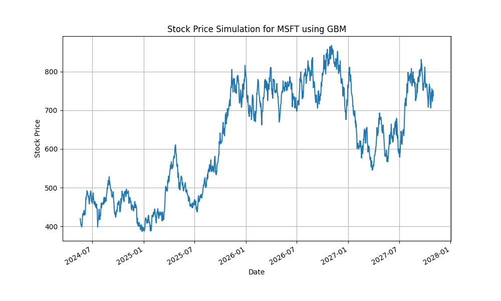

# Stock Price Simulation using Geometric Brownian Motion (GBM)

<!-- TODO: Update Example, and Possible Improvements to reflect Monte-Carlo and enhancements made. -->

## Overview

This project simulates the future stock prices of a user-specified ticker using the Geometric Brownian Motion (GBM) model. The GBM model is widely used in quantitative finance to model stock price trajectories due to its ability to capture both the drift (expected return) and volatility (random fluctuations) of stock prices. The simulation utilizes historical stock data to estimate the parameters for drift and volatility and projects future prices based on user inputs.

## Features

- Fetch historical stock data from Yahoo Finance.
- Calculate key metrics: annualized mean return (µ) and volatility (σ).
- Simulate future stock prices using the Geometric Brownian Motion (GBM) model with customizable parameters.
- Perform multiple simulations to estimate the distribution of future stock prices.
- Calculate and display summary statistics including mean, median, standard deviation, confidence intervals, and percentiles of predicted prices.
- Plot the distribution of simulated final stock prices and their paths over time.
- User-friendly input prompts for stock ticker, historical data dates, and prediction period.
- Interactive user inputs for number of simulations and prediction period.
- Dynamically display calculated parameters and simulation results for robust analysis.
- Detailed visualization of simulation results, including a histogram of final prices and multiple price projection paths.

## Requirements

- Python 3.x
- Matplotlib
- NumPy
- yfinance
- SciPy

## Installation

1. Clone the repository:

   ```bash
   git clone https://github.com/excoffierleonard/sps-gbm.git
   cd sps-gbm
   ```

2. Install the required libraries:
   ```bash
   pip install -r requirements.txt
   ```

## Usage

1. Run the script:

   ```bash
   python main.py
   ```

2. Follow the prompts:

   - **Stock Ticker**: Enter the ticker symbol of the stock (e.g., `AAPL` for Apple).
   - **Start Date**: Enter the start date for historical data in `YYYY-MM-DD` format (default is 1 years ago).
   - **End Date**: Enter the end date for historical data in `YYYY-MM-DD` format (default is the most recent close date).
   - **Prediction Period**: Enter the number of days to project the stock price (default is 1 year).
   - **Number of Simulations**: Enter the number of simulations to perform (default is 1000).

3. View the results:
   - The script will display the calculated annualized mean return (µ) and volatility (σ).
   - It will plot the simulated future stock prices and their paths over time.
   - A histogram will visualize the distribution of final predicted stock prices.
   - Summary statistics including mean, median, standard deviation, confidence intervals, and percentiles of the predicted prices will be displayed.

## Example

Input:

```
Enter the stock ticker: AAPL
Enter start date for historical data (YYYY-MM-DD) [default: 2019-01-01]:
Enter end date for historical data (YYYY-MM-DD) [default: 2024-01-01]:
Enter the prediction period in days [default: 252]:
Enter the number of simulations to perform [default: 1000]:
```

Output:

```
Annualized Mean Return (mu): 0.4590
Annualized Volatility (sigma): 0.3223
Most Recent Closing Price: 192.02

Summary of Predicted Stock Prices after 252 days:
Mean Final Price: 305.42
Median Final Price: 285.96
Standard Deviation of Final Prices: 106.80
95% Confidence Interval: (96.10, 514.74)
10th Percentile: 192.19
25th Percentile: 228.85
75th Percentile: 359.20
90th Percentile: 437.14
```



## How It Works

1. **User Inputs**: The user provides a stock ticker, the date range for historical data, and the prediction period through interactive prompts.
2. **Fetch Historical Data**: Using the `yfinance` library, the script retrieves historical stock prices for the specified date range.
3. **Calculate Annual Parameters**: The script calculates the daily returns, which are then used to compute the annualized mean return (µ) and volatility (σ).
4. **Set Prediction Parameters**: The user specifies the prediction period in days and the number of simulations to perform.
5. **Simulate Future Stock Prices**: The Geometric Brownian Motion (GBM) model is utilized to simulate future stock prices over the prediction period. This involves generating multiple simulated price paths.
6. **Run Multiple Simulations**: The script runs the specified number of simulations, storing the final projected prices of each simulation.
7. **Calculate Summary Statistics**: Key statistics, including the mean, median, and standard deviation of the final projected prices, are computed. Additionally, the script can calculate confidence intervals and probabilities of exceeding a specified target price.
8. **Plot Results**: The script generates and displays plots to illustrate the simulated stock price trajectories and the distribution of final prices. These plots help in visualizing the potential future performance of the stock.

## Possible Improvements

1. **Parameter Estimation Methods**:

   - Improve the calculation of drift (µ) and volatility (σ) using more advanced statistical methods.
   - Consider using exponential moving averages or GARCH models to capture more dynamic aspects of financial time series.

2. **User Interface**:

   - Create a graphical user interface (GUI) to make the application more user-friendly.
   - Implement interactive plots where users can hover over points to see exact values.

3. **Complete Report Generation**:

   - Include risk metrics such as Value at Risk (VaR) and Expected Shortfall (ES) in generated reports.

4. **Extend to Other Asset Classes**:

   - Adapt the model to simulate other types of financial assets like commodities, bonds, or cryptocurrencies.

5. **Integration with Data Sources**:

   - Integrate with real-time data APIs to fetch the most recent stock prices and perform live simulations.
   - Use historical fundamental data to enhance the parameter estimation.

6. **Sensitivity Analysis**:

   - Implement sensitivity analysis to understand how changes in input parameters (drift, volatility) affect the simulation outcomes.

7. **Backtesting**:
   - Develop backtesting functionality to compare the simulation results with actual historical outcomes to validate the model.

## Contribution

Contributions, issues, and feature requests are welcome! Feel free to check the [issues page](https://github.com/excoffierleonard/sps-gbm/issues).

## License

This project is licensed under the MIT License. See the [LICENSE](LICENSE) file for more details.

## Acknowledgments

- This project utilizes the `yfinance` library to fetch historical stock data.
- Inspiration from "Stochastic Calculus for Finance II" for the GBM model.
